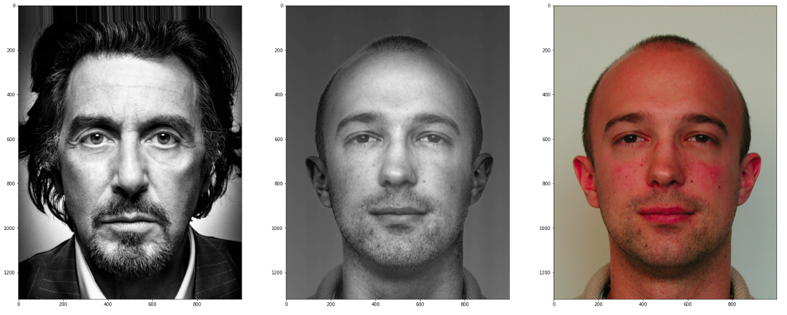
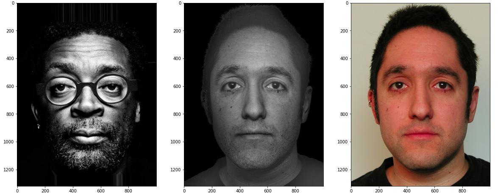

# StyleHead 


## Brief Description

Style your potrait headshort by reference to potrait you like, while matching properties such as the local contrast and the overall lighting direction while being tolerant to the unavoidable differences between the faces of two different people




## Setup and Installation

- must have proper `requirements.txt` file having even the version information.
- must use either conda environments or python virtual environments to code your project.

#### Create a virtualenv and activate it

```sh
virtualenv env
source env/bin/activate
```
## Download all the necassary libraries with specfic versions

all the libraries will be downloaded by running the command

```
bash queries.txt
```

All the necassary libraries versions are given in requirements.txt

Test style transfer code on local machine:

```
cd src
python3 test.py
```

Run all the demos in order for step by step walkthorugh of our entire repository codes.

### Dataset use-
all the images used in the demo are present in /data/inputs/examples folder
We have choosed few reference images and input images from the dataset according to the reference paper

dataset given by the refrence paper with code -  http://groups.csail.mit.edu/graphics/face/tracker/release/zipfiles/code.zip
<br />
OneDrive link for the whole dataset -  https://1drv.ms/u/s!AufWkcWWKM7kgdRy1fkHVDrJNyfFTw?e=WOiCdp

the dataset contain images of different style taken by different professional photographers
## File Descriptions-

#### src/test.py - 
It is a file which consists of entire work, i.e., if input is given after running this file, we get a output.

#### src/labspace.py -
it contain the entire pipeline Multiscale Transfer of Local contrast

#### src/wrapoperator.py -
Face warping to obtain dense correspondences between the input and reference images.

#### src/labspace_withNormCrossCoeff.py - 
To consider a example image with similar characterstics to input image, 
we use normalised cross correlation of concatenated energy maps of input and example 
for comparing priority of examples for a input.

#### src/Eye_highlight_new.ipynb -
Notebook contains experimental eye-highlights transfer part using hough circle transform, kmeans and inpainting.


## Demo file are


1. src/Full_StyleTransfer.ipynb

2. src/PipelineBreakdown.ipynb

3. src/DenseCorrespondence_WarpOperator.ipynb

4. src/AutomaticSelection_using_CrossCorrelation.ipynb

## Sample outputs

Give sample outputs - both success and failure cases for the techniquie you have used.

### Success (by using automatic selection)-


### Failure case no proper close image-



## Team Information

    Team Name - DIP_Squad

    
    Team Members-​

    1) Nagulapalli Raviteja - 2021102009

    2) TDKS Abhishek - 2021102010

    3) T. Ravindra - 2021102025

    4) Irugula Hanish Reddy - 2021102005

## Biblography:
List all resources you used - starting from most important (the original paper you are trying to implement) to least important and give a brief description of why you used the resource. Use hyperlinks to keep the readme neat.

Style Transfer Paper- https://people.csail.mit.edu/yichangshih/portrait_web/
<br />
Code Base of the above paper -http://groups.csail.mit.edu/graphics/face/tracker/release/zipfiles/code.zip 
<br />
Face Warping - https://learnopencv.com/face-morph-using-opencv-cpp-python/#id1540306373
<br />
Image Pyramids - https://docs.opencv.org/4.x/dc/dff/tutorial_py_pyramids.html
<br />
laplacian-pyramid - https://theailearner.com/tag/laplacian-pyramid-opencv/
<br />
pupil finder- https://www.geeksforgeeks.org/circle-detection-using-opencv-python/
